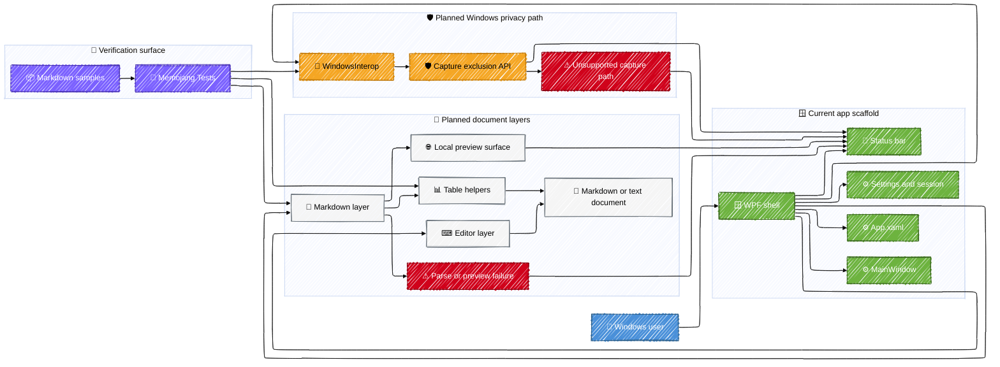

# Architecture Overview

This diagram shows the V1 target architecture anchored by the current .NET 10 WPF scaffold. It is not a feature completion claim.

```mermaid
%%{init: {'theme': 'base', 'look': 'handDrawn', 'layout': 'elk'}}%%
flowchart LR
    classDef entry fill:#4A90D9,stroke:#2C5F8A,color:#FFFFFF
    classDef app fill:#6DB33F,stroke:#3D6B22,color:#FFFFFF
    classDef domain fill:#F5F5F5,stroke:#6C757D,color:#000000
    classDef interop fill:#F5A623,stroke:#C47D0E,color:#000000
    classDef verify fill:#7B61FF,stroke:#4B35B5,color:#FFFFFF
    classDef risk fill:#D0021B,stroke:#8B0011,color:#FFFFFF

    User["👤 Windows user"] --> Shell["🪟 WPF shell"]

    subgraph App["🪟 Current app scaffold"]
        Shell --> AppEntry["⚙ App.xaml"]
        Shell --> MainWindow["⚙ MainWindow"]
        Shell --> Status["📍 Status bar"]
        Shell --> Settings["⚙ Settings and session"]
    end

    subgraph Editing["📄 Planned document layers"]
        Shell --> Editor["⌨ Editor layer"]
        Shell --> Markdown["📄 Markdown layer"]
        Markdown --> Tables["📊 Table helpers"]
        Markdown --> Preview["🌐 Local preview surface"]
        Editor --> Document["💾 Markdown or text document"]
        Tables --> Document
        Preview --> Status
        Markdown --> ParseError["⚠ Parse or preview failure"]
        ParseError --> Status
    end

    subgraph Privacy["🛡 Planned Windows privacy path"]
        Shell --> Interop["🔌 WindowsInterop"]
        Interop --> CaptureApi["🛡 Capture exclusion API"]
        CaptureApi --> Status
        CaptureApi --> CaptureError["⚠ Unsupported capture path"]
        CaptureError --> Status
    end

    subgraph Verification["🧪 Verification surface"]
        Tests["🧪 Memojang.Tests"] --> Markdown
        Tests --> Tables
        Tests --> Interop
        Samples["📦 Markdown samples"] --> Tests
    end

    class User entry
    class Shell,AppEntry,MainWindow,Status,Settings app
    class Editor,Markdown,Tables,Preview,Document domain
    class Interop,CaptureApi interop
    class Tests,Samples verify
    class ParseError,CaptureError risk
```
